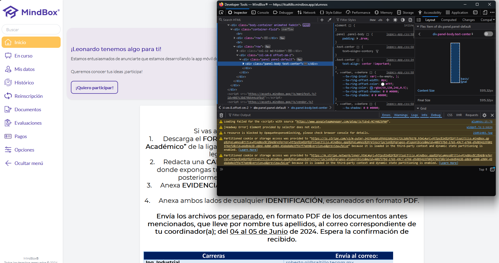
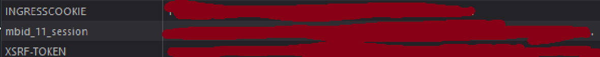
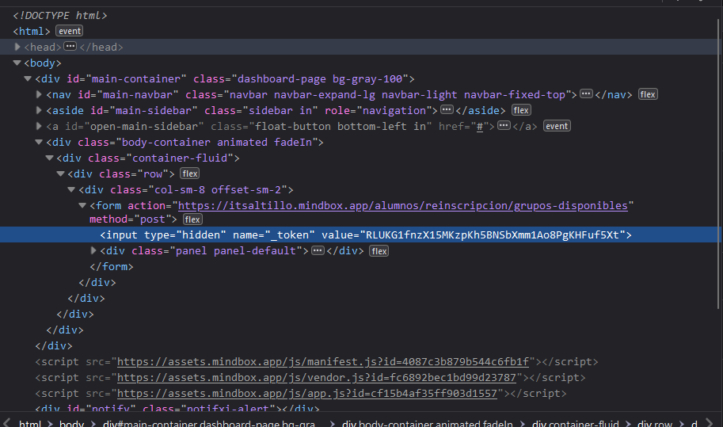
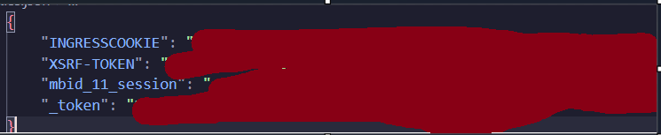
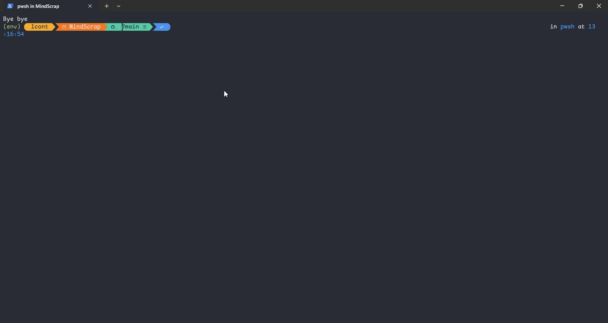

# MINDSCRAP

Esta herramienta esta hecha para poder scrappear la informacion respecto a los horarios en la pagina mindbox https://itsaltillo.mindbox.app

## INDEX  

- [Como usarla](#como-usarla)
    - [Linux o MacOs](#linux-o-macos)
    - [Windows](#windows)
- [Configuracion](#configuracion)
- [Ejemplo](#ejemplo)


## GENERAR TU HORARIO  

PRIMERO TIENES QUE SEGUIR LOS PASOS DE [Como usarla](#como-usarla).

Para poder generar tu horario necesitaras primero asegurarte de tener la configuracion adecuada
(checa [Configuracion](#configuracion)).  
Una vez que estes seguro tienes que seleccionar la opcion numero 2 de el menu de la interfaz.  
A continuacion habran varias opciones, tendras que primero seleccionar los semestres de donde quieres elegir materias.
Seguido de esto deberas de elegir las materias de ciertos semestres que quieres elegir, una vez hecho eso te saldran todas las opciones con los grupos disponibles.

A partir de aqui tendras que seleccionarlos como indica el programa y si todo sale bien te saldran las combinaciones.

## COMO USARLA

Tienes que tener Python instalado y git.

Con git metete a cualquier carpeta y solamente clona el repositorio
```sh
git clone https://github.com/NexWan/MindScrap
```  


Para empezar tendras que tener instalado Python, despues tendras que crear un entorno virtual (venv)
```sh
python -m venv env
```
### LINUX o Macos
Para activar el entorno virtual en linux usa el siguiente comando:
```sh
source env/Scripts/activate
```

### WINDOWS
En windows utiliza el siguiente comando
```sh
./env/Source/activate
```

Una vez activado tu entorno virtual utiliza el siguiente comando para instalar las librerias utilizadas:
```sh
pip install -r requirements.txt
```

Una vez hecho eso solo basta con correr el siguiente comando para ejecutar el script:
```sh
python src/main.py
```

## CONFIGURACION
Esta herramienta requiere de las cookies de tu sesion de mindbox.  
Esto debido a que para iniciar sesion tiene que existir una "sesion" activa (o sea tus cookies), el como obtenerlas es relativamente facil, solo sigue los siguientes pasos:  

1. <b> Entra a la pagina de mindbox y loggeate </b>  
Solamente inicia sesion en [mindbox](https://itsaltillo.mindbox.app\alumnos) como de costumbre.  
2. <b> Abre herramientas de desarrollador </b>  
Si utilizas un navegador normal (o sea no safari) solamente basta con que hagas click derecho a la pagina y selecciones "inspeccionar elemento o inspect element" para abrir las herramientas de desarrollador o presionando F12 en tu teclado, una vez abierto es hora de buscar las cookies  
   

3. <b> Conseguir tus cookies de sesion </b>  
En las herramientas de desarrollador tendras que irte a el apartado de storage (o almacenamiento en spanish), de ahi tendras que irte a el apartado de Cookies, seleccionas la de la opcion "https://itsaltillo.mindbox.app" y tendras que copiar el valor de las siguientes cookies:
  
(solo dale doble click en donde dice value/valor y copialo cada uno).

4. <b>Obtener el id de busqueda</b>  
Este paso es muy importante ya que la busqueda/request requiere de un token algo escondido, lo que tienes que hacer es meterte a el apartado de grupos disponibles, y abrir el inspeccionador de elemento de nuevo para obtener este token.


5. <b>Ponerlas en cookies.json</b>

Si es la primera vez que ejecutas el script, deberia generarte un archivo en la carpeta raiz del programa, se llamara 'cookies.json', ahi pondras las cookies de la siguiente forma:


6. <b> Ejecutar el programa </b>

Ahora solo bastaria correr el script con el comando 
```sh
python src/main.py
```

## EJEMPLO

Si quieres ver un ejemplo de como almacena la informacion ve a el siguiente [enlace](example/example.json)

### Ejemplo de uso para generar horario

